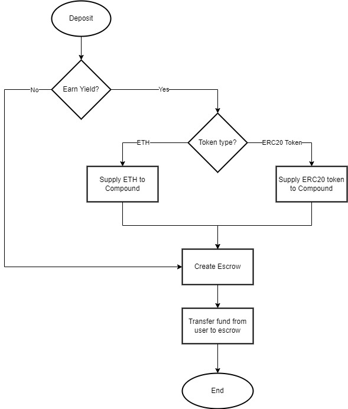
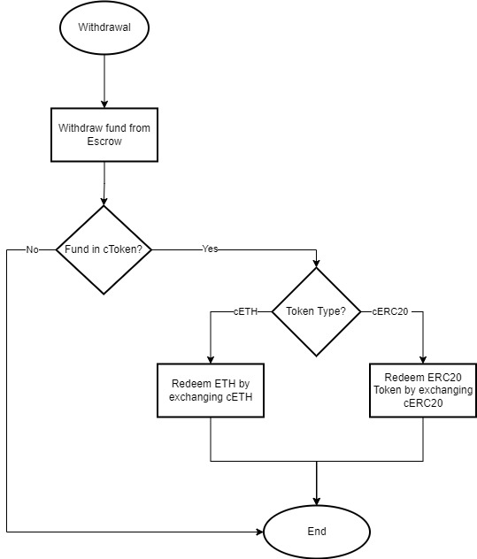

# Assignment

The coding assignment is to gauge your solidity skills and consists of:-

a) a code review assignment; and
 
b) an integration component

## a) Code Review
------------------------------------------------------------------------

In broad, an escrow arrangement flow is as follows:-

1) Receipient/Sender (or a third-party) may create an escrow accounts(s) with an Escrow Agent;

2) Sender may initiate fund transfer to the Escrow Account;

3) Both Sender and Receipient (2 out of 3 parties) can agree to the release of funds to the Receipient or a revert of funds to the Sender;

4) In the event that both the Sender and the Receipient are unable to jointly agree to the release or revert of funds, and Escrow Agent may adjudicate the release or refund of funds based on the terms of the escrow agreement; and

5) Receipient/Sender's signature can be based on a signing mandate/multi-signature approach where all relevant signatories must authorise the particular blockchain action.

## b) Integration Component
------------------------------------------------------------------------

To allow the user to have the option of supplying either Ether or any ERC20 token (supported by Compound) locked in the smart contract escrow to the Compound protocol via Solidity.

To elabrate:-

- If the user decides to earn yield off their Ether/ERC20, the tokens will be deposited to Compound (and cTokens will be stored in escrow); or
- However, should the user choose not to earn yield, the Ether/ERC20 tokens will be locked in escrow.

Ether/ERC20 should be supplied to Compound at the point of deposit (e.g. only store c(ETH) in the smart contract escrow).

Ether/ERC20 should subsequently be retrieved only at the point of withdrawal.

### Assumption

The following flowcharts are the assumption made when the user deposit funds into an escrow and make a withdrawal.

 

- If the user decided to earn yield:-

1) Their Ether/ERC20 tokens are deposited into Compound via the contract and cToken is minted and transferred to their wallet.

2) The user may create an escrow based on the number of cTokens minted and initiate the transfer of the cToken to the escrow.

 

- When the user decided to withdraw the released funds from the escrow:-

1) The user will transfer the cToken from the escrow to their wallet.

2) The user may redeem the cToken in their wallet by exchanging with Compound to the underlying Ether/ERC20 via the contract.

### Flow Chart - Deposit
 

 
### Flow Chart - Withdrawal
 

